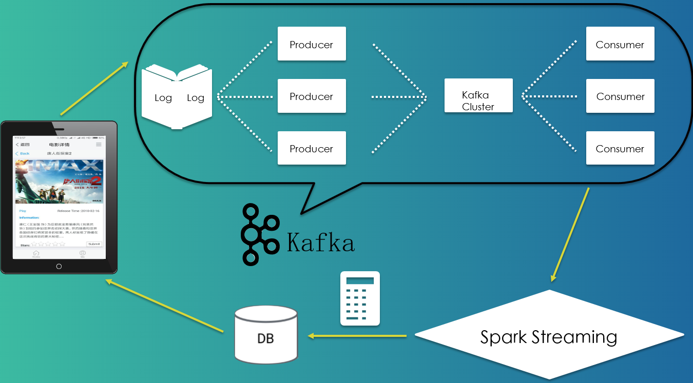
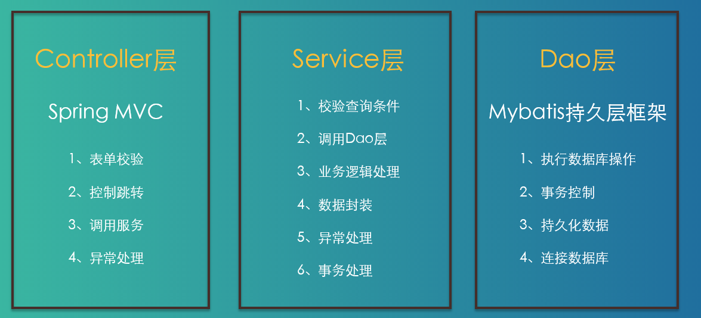
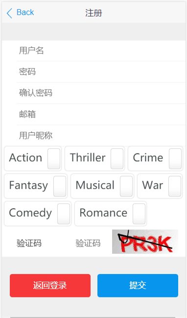
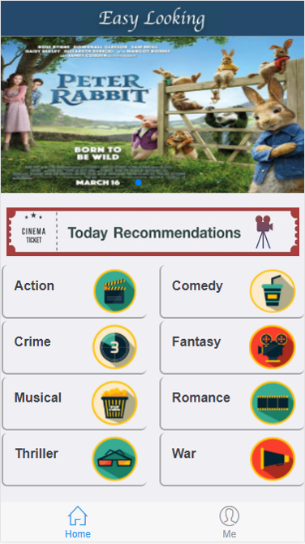
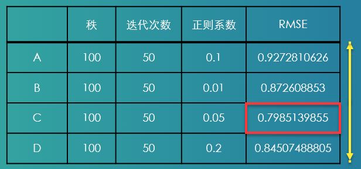

#  :art:大数据过滤推荐引擎

## 项目名称

EasyLooking（电影轻松看）

## 简介

本项目是基于大数据技术，对用户所点击的电影类型进行分析，通过所得数据帮助用户自动推荐符合用户喜好的电影类型，系统包括**电影推荐引擎**和**电影网站（前后端）**两大部分——EasyLooking。

 
        

该项目**使用Spark通过已经获得到的所有会员电影的评分数据集，来推断每个会员的喜好**，并向会员推荐合适的电影，同时也可以将电影推荐给感兴趣的用户，达到个性化的推荐效果，以此来达到增加会员，提高营业的收入的目的。

## 技术栈

- Java,Scala 
- Hadoop,Spark ,MySQL 
- SpringMVC,Spring,MyBatis

## 项目整体架构

 
        

## 一、:zap:电影推荐引擎

### 开发环境：

- IntelliJ IDEA
- Maven

### 技术栈：

- Spark+SparkStreaming
- Scala

### 架构：

 
        

## 二、:hammer:电影网站

### 开发环境：

- IntelliJ IDEA
- Maven

### 技术栈：

- SpringMVC+Spring+MyBatis
- MySQL

### 架构：

 
        

## :apple: 效果展示

### 登陆界面：

 
        

### 主页面：

 
        

## :pencil: 分析

### 离线推荐

离线推荐部分采用[协同过滤算法(ALS)](http://dblab.xmu.edu.cn/blog/1461-2/),根据**用户的喜好推荐**和**根据电影的相似度推荐**两个部分。

### 实时推荐

利用SparkStreaming+Kafka的架构用流计算的方式来分析数据，其中分析的方法是：

- 给待评分电影设置的基础优先级
- 高分电影的奖励因子
- 低分电影的惩罚因子

### 评估

利用[RMES（均方根误差）](https://baike.baidu.com/item/%E5%9D%87%E6%96%B9%E6%A0%B9%E8%AF%AF%E5%B7%AE/3498959?fromtitle=RMSE&fromid=6536667)的方式来评估推荐的结果。其中包含以下几个影响因子：

- 秩

- 迭代次数

- 正则系数

 
        

## 参与人员

- <a href="https://github.com/https://github.com/Shen1K">
  ​    </a>

- <a href="https://github.com/https://github.com/906798724">
  ​    </a>

## 参考资料

- [Spark ALS文档](https://spark.apache.org/docs/2.2.0/ml-collaborative-filtering.html)
- [基于协同过滤算法的电影个性化推荐系统设计与实现](http://www.cnki.com.cn/Article/CJFDTotal-RJDK201501033.htm)

